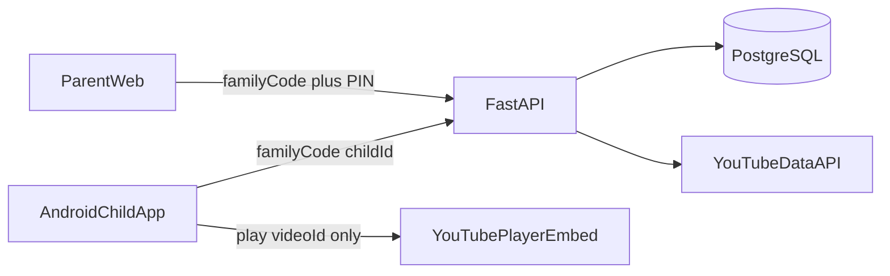

# Plan d’implémentation — YouTube famille verrouillé

## Décisions produit (figées)

- **App Android** : profil enfant uniquement. Aucun écran parent, aucun PIN, aucun lien vers le site parent.
- **Parent** : site web uniquement. Login = **code famille + PIN**. Création famille, profils enfants, chaînes par enfant, limite de temps.
- **Chaînes** : ajoutées uniquement par le parent ; liste proposée à l’enfant = chaînes approuvées de **son** profil. Filtres optionnels par chaîne (OU sur le titre ; vide = tout).
- **Lecture** : vidéos classiques uniquement (pas de Shorts) ; player contrôlé, pas de YouTube libre / suggestions hors chaînes autorisées.
- **UI** : français + anglais ; design **neutre / minimal** (pas “kids coloré”, pas cinéma sombre).
- **Code** : modules ; fonctions **25–50 lignes** max ; **unit tests** sur chaque feature.

## Architecture

Monorepo :

- [`android/`](android/) — app enfant (Kotlin, Compose)
- [`backend/`](backend/) — FastAPI + PostgreSQL + portail parent (Jinja2)
- [`docs/`](docs/) — setup clés API, lancement local

## Backend (`backend/`) — Python / FastAPI

**Stack** : FastAPI, SQLAlchemy 2, Alembic, PostgreSQL, httpx (YouTube Data API), Jinja2 + CSS minimal pour le portail parent, pytest.

**Packages (modules)** :

- `backend/app/domain/` — modèles métier purs (Family, Child, Channel, WatchQuota)
- `backend/app/repositories/` — accès DB
- `backend/app/services/` — use cases (create family, add channel, resolve channel URL, check quota)
- `backend/app/api/` — routes REST enfant + parent
- `backend/app/web/` — pages HTML parent
- `backend/tests/unit/` — un dossier par feature

**Modèle de données** :

- `families` : `id`, `code` (ex. `AB12CD`), `pin_hash` (bcrypt), `created_at`
- `children` : `id`, `family_id`, `name`, `daily_limit_minutes`, `avatar_color`
- `channels` : `id`, `child_id`, `youtube_channel_id`, `title`, `thumbnail_url`, `status=approved`
- `watch_sessions` / agrégat journalier : minutes consommées par `child_id` + `date`

**Flux parent (web)** :

1. `/` créer famille → affiche code famille + choix PIN
2. `/login` code + PIN → session cookie httpOnly
3. Dashboard : CRUD enfants, limite minutes/jour, ajouter chaîne (URL ou @handle) → validation via YouTube Data API → stockée pour **cet** enfant
4. Aucune mention “enfant peut demander” : seul le parent ajoute

**Flux API enfant** (sans secrets parent) :

- `POST /api/child/join` `{ family_code }` → liste des profils enfants (noms + ids)
- `POST /api/child/session` `{ family_code, child_id }` → token enfant court (pas de PIN)
- `GET /api/child/channels` → chaînes du profil
- `GET /api/child/videos?channel_id=` → vidéos non-Shorts (filtrées côté service)
- `POST /api/child/watch/heartbeat` → incrémente minutes ; `403` si quota dépassé
- `GET /api/child/quota` → minutes restantes (message neutre, sans jargon “parental”)

**YouTube** : clé API serveur uniquement. Résolution channel URL → `channelId` ; liste uploads ; exclure Shorts (durée / flag API selon dispo).

## Android (`android/`) — Kotlin multi-modules

**Modules** :

| Module | Rôle |
|--------|------|
| `:app` | navigation, DI |
| `:core:domain` | models + interfaces repositories / use cases |
| `:core:data` | Retrofit API, DataStore (family code, child id, langue) |
| `:core:ui` | thème neutre minimal, strings FR/EN |
| `:feature:join` | saisie code famille + choix profil |
| `:feature:home` | liste des chaînes autorisées |
| `:feature:videos` | liste vidéos d’une chaîne |
| `:feature:player` | lecture embed contrôlée (un `videoId` à la fois) |
| `:feature:quota` | affichage temps restant + blocage lecture |

**Règles code** : une responsabilité par fonction ; découper dès > ~40 lignes ; ViewModels fins qui délèguent aux use cases du domain.

**Verrouillage contenu** :

- Navigation uniquement Join → Home → Videos → Player
- Player : lib embed (ex. `android-youtube-player`) avec callbacks ; **pas** de WebView YouTube libre
- Interdire navigation hors `videoId` validé (liste API de la chaîne autorisée)
- Fin de vidéo → retour liste ou suivante de **la même** chaîne

**Design enfant** : fond clair neutre, typo soignée non-système, une action par écran, gros targets tactiles, zéro badge “contrôlé par un parent”.

## Tests (obligatoires par feature)

- **Backend** : create family, login PIN, add channel to child, filter Shorts, quota heartbeat reject when exceeded
- **Android** : use cases Join, LoadChannels, LoadVideos, CanWatch (quota), ParseChannelId — JUnit + mocks ; pas besoin d’émulateur pour les unit tests domain/data

## Ordre de build

1. Scaffold monorepo + Docker Compose (Postgres + API)
2. Domain + DB + auth famille (code + PIN) + tests
3. Portail parent Jinja (création, login, enfants, chaînes, limites)
4. API enfant + proxy YouTube (channels/videos/quota) + tests
5. Android modules + Join/Home/Videos/Player/Quota + tests unitaires
6. i18n FR/EN (app + web)
7. README setup (clé YouTube, variables env, lancement)

## Hors scope v1

- Demandes de chaînes initiées par l’enfant
- Mode parent dans l’app Android
- Shorts, recherche YouTube globale, multi-comptes email
- Publication Play Store / hébergement prod cloud (dev local Docker suffit)

## Todos

1. Scaffold monorepo `android/` + `backend/` + docker-compose Postgres
2. FastAPI domain/DB/auth famille (code+PIN) + tests unitaires
3. Portail parent Jinja: famille, enfants, chaînes, limites temps
4. API enfant + YouTube (channels/videos/quota) + tests
5. Modules Kotlin Compose: join, home, videos, player, quota + tests
6. i18n FR/EN + README setup clés et lancement
